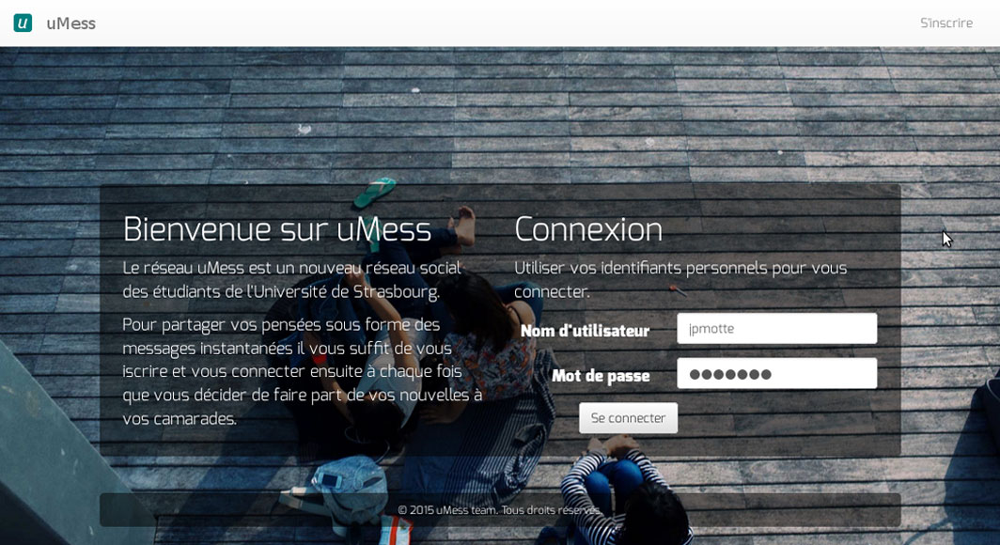

# uMess

uMess is a little social netwrok developped using **node.js** within our classes of Web programming at the University of Strasbourg.

## Implemented functionalities

	- user authentication
	- sending messages which are readable by every connected user on the news feed
	- storing sent messages until new login
	- change of user information (like: First Name, Surname, Personal description, E-mail address, etc.)
	- choice of user profile image

## Notes and recommendations

> There are some user accounts already created for testing purposes only.
> So, for testing, you can login as Homer Simpson (username: hsimpson, password: magma)
> or as Peter Konečný (username: peko, password: peko).
> You are always free to create your own account or accounts.
> Enjoy uMess!

## Preview

## Authors

[Marek Felsoci](mailto:marek.felsoci@etu.unistra.fr) and Arnaud Pinsun, students at the [University of Strasbourg](http://www.unistra.fr).

## License

Our work is released to the public domain.
